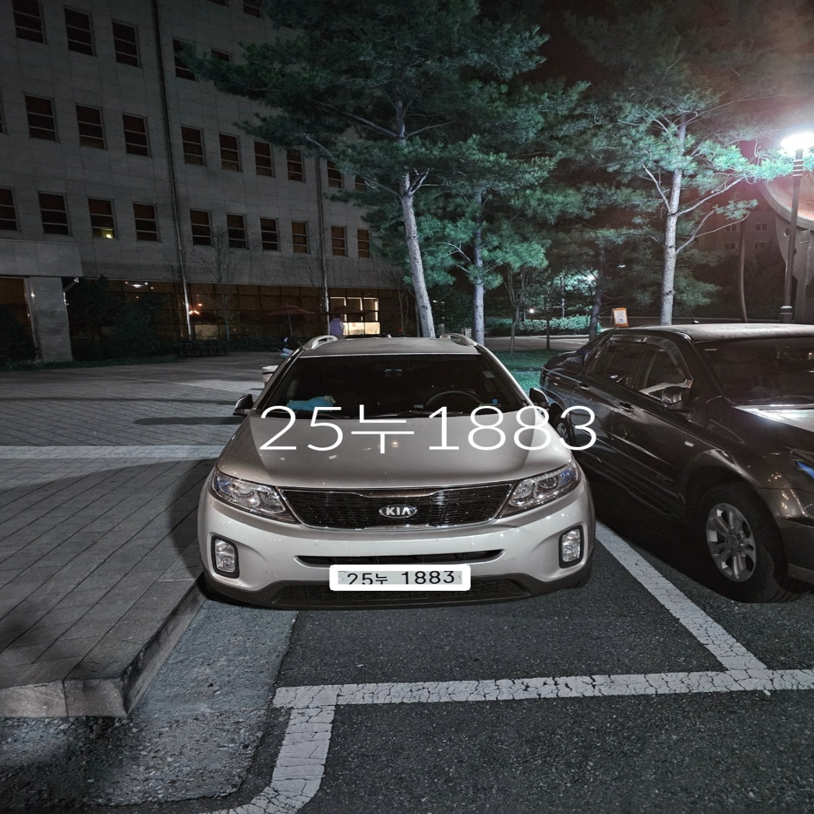
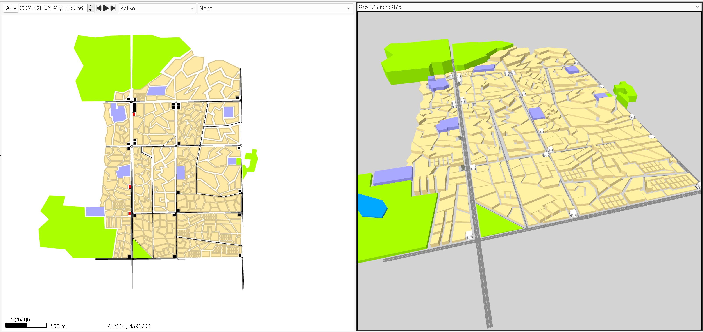
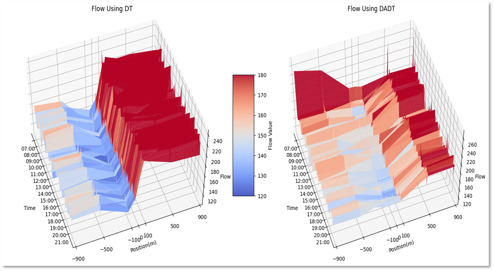

# SW-One_Stop_Drone_Thru_System

<p align="center">
  
</p>

## System Requirements
- **Operating System**: Ubuntu 22.04.3 LTS
- **CPU**: 12th Gen Intel(R) Core(TM) i7-12700F
- **GPU**: NVIDIA GeForce RTX 4070 (12GB VRAM)
- **System Memory (RAM)**: 32GB

### Preparation
First, clone the repository
```bash
git clone https://github.com/senseable-ai/SW-One_Stop_Drone_Thru_System.git
```
Then download the required packages.
```bash
pip install -r requirements.txt
```

| Description | Image                                 |
|-------------|----------------------------------------|
| 번호판 인식 결과 |       |
| Simulation 구축 |       |
| Drone Thru Flow 분석 결 |       |


## Reference
- [EasyKoreanLpDetector](https://github.com/gyupro/EasyKoreanLpDetector)
- [tello-gesture-control](https://github.com/kinivi/tello-gesture-control)
